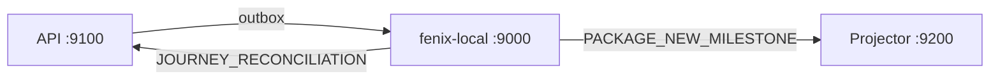

# Prompt — Onboarding (delivery-history)

Onboarding/preflight mínimo para agentes. **No duplica status** — eso vive solo en `plan.md`.

---

## Reglas críticas (AGENTS.md)

1. No modificar `AGENTS.md` ni `<rootDir>/framework` — **excepción:** capa Fenix queue/outbox en API (`plan.md` § B.7; B.7.1 ya aplicada). Projector comparte el mismo framework (solo consume; no emite).
2. Patrón repository + mapper + provider; TypeScript estricto (sin `any`).
3. Implementación incremental; tests en fase 2 salvo pedido explícito.

Proyectos: `shipments-history-api/`, `shipments-history-projector/`, `fenix-local/`.

## Reglas críticas (consumo de capacity/tokens)

1. NUNCA JAMAS edites mocks. Deberían ser generados y re-generados con los scripts específicos en todo turno que sea necesario.

---

## Runtime, MCP Postgres y terminal (CRÍTICO)

### Quién corre qué

| Acción | Agente | Usuario |
|--------|--------|---------|
| Levantar servicios (`start:dev`, Docker, fenix-local, API, projector) | **NUNCA** | Sí |
| `npm run build` / `npm test` / `npm run lint` / Artillery / orchestrator | **NUNCA** | Sí |
| Editar código, leer docs, razonar sobre diffs | Sí | — |
| SQL read-only para validar estado post-run del usuario | Sí, controlado | — |

**El usuario es el único con potestad de ejecutar procesos en terminal** (servicios, builds, tests, linters, seeds pesados, `testing-orchestrator`). Los agentes **no** arrancan el proyecto ni verifican compilación corriendo comandos — asumen que el usuario ya levantó lo necesario o lo hará después del cambio.

### MCP Postgres (`shipments-history-postgres`)

Disponible en sesión. Postgres local es **multidb** en `localhost:5432`:

| DB | Proyecto |
|----|----------|
| `shipments-history-api` | API (write model) |
| `shipments-history-projector` | Projector (read model) |

- **Un proyecto por turno/sesión** en la práctica → conectar mentalmente a **una** DB según el target (`POSTGRES_DATABASE_URL` en `.env.example` de cada repo).
- **Queries cross-DB no son opción ni necesidad.** Si la tarea toca ambos lados, validar **cada DB por separado** — típicamente después de que el usuario corrió `testing-orchestrator` (`warehouse` / `e2e`).
- Usar MCP (`execute_sql`, `list_objects`, …) o `psql` **solo lectura** para confirmar hipótesis (ej. conteos, `delivery_history_view_shipments`, outbox) — no para mutar datos salvo pedido explícito de migración/seed en código.
- **Magnitud:** el projector puede tener cientos de miles de views. Evitar `SELECT *` sin `LIMIT`, scans full-table innecesarios o agregados pesados. Preferir filtros por `id` / `display_id` / muestra acotada. Referencia: `local-testing-quide.md`.

Si MCP conecta a la DB `postgres` (maintenance), las tablas de app están en las DB nombradas arriba — cambiar la URL mental según proyecto target; no hace falta unificar en una sola query.

---

## Mapa de documentos

| Pregunta | Leer |
|----------|------|
| ¿Qué falta implementar? | **`plan.md`** |
| ¿Qué es un MilestoneKey / tramo / gate? | **`domain-model.md`** |
| ¿Cómo corro E2E local? | **`local-testing-guide.md`** §1 |
| ¿E2E automatizado (warehouse / andreani / full)? | **`testing-orchestrator/README.md`** |
| ¿Queries SQL de validación? | **`local-testing-guide.md`** · MCP Postgres (read-only, ver § Runtime) |
| ¿Contrato Fenix bulk / relay LPC? | **`plan.md` § B.7** |
| ¿Payload / blocks API? | **`blocks-api.md`** (spec diseño) |
| ¿Contrato detalle HTTP v2 / Block R2? | **`blocks-projector.md`** Block 8 §8.1 + Block R2 |
| ¿Integración detalle ↔ backoffice (mapeo FE)? | **`detail-api-frontend-contract.md`** |
| ¿Blocks projector? | **`blocks-projector.md`** (spec diseño) |
| **¿Search index + list `q` + filtros?** | **`plan.md` C.5–C.6** (funcional) · **`blocks-projector.md` Block 11–12** (diseño) |
| **¿Integración FE search?** | **`backoffice-list-search-integration.md`** |
| **¿Search performance / load test?** | **`search-performance-spec.md`** · `testing-orchestrator` `search-load` |
| ¿Patrón search origen (RFC2)? | **`rfc2.md` §7.3** (nombre viejo `shipment_search_index`) |
| ¿Terminales FAILED / CANCELLED / listabilidad? | **`plan.md` § B.8** |
| ¿OOLL timestamps / mapeo Andreani? | **`domain-model.md`** §1.1, §4.4 · **`blocks-api.md` §5.9** |
| ¿Flujo negocio? | **`logistics.md`** |

---

## Arquitectura local

| Servicio | Puerto |
|----------|--------|
| fenix-local (queue-event-generator emulator) | `9000` |
| shipments-history-api | `9100` |
| shipments-history-projector | `9200` |



**Fenix:** prod usa `POST /api/event` y `POST /api/event/bulk` (MSK/Kafka). Local: mismo contrato en `fenix-local/`.

```bash
# API local
FENIX_GENERATOR_URL=http://localhost:9000/api/event
CORE_SKIP_FENIX_QUEUE=false
```

Subscribers: `fenix-local/.env.example`.

---

## Dominio (resumen)

Fuente completa: **`domain-model.md`**.

- Trazabilidad **package-centric**; projector no recibe drafts (`DRAFT_BASE`).
- Cuatro capas: timestamps operativos → timeline → macro/subStatus → **`MilestoneKey`** (UI).
- Tramos v1: `FIRST_MILE` (hasta `oeLaunchAt`) → `LAST_MILE` (CD + OOLL + entrega).
- Gates que emiten al projector: `OE_LAUNCH` → `WAREHOUSE_RECEIVED`; dispatch shipped → `LAST_MILE_DISPATCHED`; OOLL → incremental / `DELIVERED` / macro `FAILED` / `CANCELLED` (terminales — `plan.md` § B.8).
- Clasificación WMS: **persist only**, sin outbox.
- Watermark: lectura en gate; claim + outbox en `FenixOutboxProducer` post-return (`domain-model.md` §5.1).

---

## Estado actual (2026-06-25)

Ver detalle en **`plan.md`**. Resumen:

- **Fase A** tramos API — DONE
- **Fase B** gates + watermark + Andreani B.5 + **B.5.8 `OollProcessingService`** + **B.7 bulk LPC** + **B.8 terminales FAILED/CANCELLED** — DONE (B.8.5 manual cancel pending; B.7.4 docs pending)
- **Fase C** C.1 + C.3 + **C.7** + **C.5 + C.6 search** + **C.2 HTTP catalog (mock/static)** — DONE / PARTIAL (tabla `milestones` pending; **C.4** tramo pending)
- **Block R2** detalle v2 — **DONE**
- **fenix-local** `/api/event` + `/api/event/bulk` — DONE
- **E2E orchestrator** — `warehouse` ✅ · `e2e` ✅ · **search-load** Artillery ✅
- **Next API (secundario):** B.7.4 docs → B.8.5 manual cancel → B.6 runbook manual EP-ready→WMI
- **Next projector:** search **performance** P1 (`search-performance-spec.md`) · **C.4** · **C.2** persistencia `milestones`

### Search — estado

| Pieza | Estado |
|-------|--------|
| C.5 índice en tx de proyección | ✅ **DONE** |
| C.6 list `q` + filtros (`courier`, `deliveryType`, `milestone`) | ✅ **DONE** |
| Mocks decorator (filtros en memoria) | ✅ |
| Artillery `search-load` / `search-artillery` | ✅ |
| Performance lectura P1 (query única, índices parciales, select mínimo) | ❌ **PENDING** — `search-performance-spec.md` |
| Índices ampliados / denormalización / Block 13 | ❌ **DEFERRED** (P2) |
| Integración FE (`onFiltersChange` → API) | Spec en **`backoffice-list-search-integration.md`** |

Spec funcional: **`blocks-projector.md` Block 11** + **Block 12**. Patrón origen: **`rfc2.md` §7.3**.

**Decisiones HTTP (cerradas):** `q` en `GET /delivery-history/shipments` — sin controller aparte. Paginación: `total` = conjunto filtrado. Mínimo **3** chars en `q` (BE 400 / FE no dispara antes). Debounce FE **300 ms** — ver `backoffice-list-search-integration.md`.

---

## Handoff — orden de lectura (nuevo agente)

1. **`prompt.md`** (este archivo) — reglas + mapa + **§ Runtime/MCP** (no `start:dev` / no build-test-lint)
2. **`plan.md`** — status único
3. **`domain-model.md`** §4 (`MilestoneKey`, `current_milestone`, listabilidad)
4. **`blocks-projector.md` Block 11** → Block 12 (diseño search; status en `plan.md`)
5. **`AGENTS.md`** workspace + `shipments-history-projector/AGENTS.md`
6. Si search performance: **`search-performance-spec.md`**
7. Si integración FE: **`backoffice-list-search-integration.md`**

---

## Antes de codear

1. `domain-model.md` (gates / watermark si tocás emisión; §4 si tocás search/milestone)
2. `plan.md` (task concreta)
3. Block relevante en `blocks-api.md` o `blocks-projector.md`; search perf → `search-performance-spec.md`
4. `AGENTS.md` del proyecto target
5. Si detalle HTTP: `blocks-projector.md` Block 8 §8.1 + Block R2
6. Si Fenix/E2E: `local-testing-guide.md` §1 o `testing-orchestrator/`

**Patrón outbox:** gate `return { event }` → interceptor → `FenixOutboxProducer`. El use case **no** escribe outbox ni watermark.

---

## Quick start local (solo usuario — agentes no ejecutan)

Comandos de **`local-testing-guide.md`** §1 son **copy-paste del operador humano**, no tareas del agente. El agente puede citarlos o indicar qué validar después; **no** los corre en terminal.

Scripts clave en API (usuario):

- `npm run db:seed:app-config` / `db:seed:status-mappings`
- `seedEpReadyToCollectOrders.js --base-url=http://localhost:9100/api/v1`
- `npm run db:seed:journey-announcements-from-ep-ready`
- `simulateAndreaniEvents.js` (siempre `--count=1`)

Manual consume: `POST /api/v1/ingestor/fenix-queue/consume` — tabla de flows en `local-testing-guide.md` §2.

---

## Autoridad ante contradicciones

1. **`domain-model.md`** — dominio (milestones, tramos, gates)
2. **`plan.md`** — status e implementación
3. **`blocks-*.md`** — spec de diseño por block (status puede estar desactualizado)
4. Este prompt — solo onboarding


