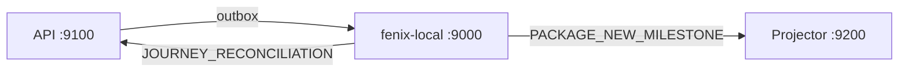

# Prompt — Onboarding (delivery-history)

Onboarding mínimo para agentes. **No duplica status** — eso vive solo en `plan.md`.

---

## Reglas críticas (AGENTS.md)

1. No modificar `AGENTS.md` ni `<rootDir>/framework` — **excepción:** capa Fenix queue/outbox en API (`plan.md` § B.7; B.7.1 ya aplicada). Projector comparte el mismo framework (solo consume; no emite).
2. Patrón repository + mapper + provider; TypeScript estricto (sin `any`).
3. Implementación incremental; tests en fase 2 salvo pedido explícito.

Proyectos: `shipments-history-api/`, `shipments-history-projector/`, `fenix-local/`.

## Reglas críticas (consumo de capacity/tokens)

1. NUNCA JAMAS edites mocks. Deberían ser generados y re-generados con los scripts específicos en todo turno que sea necesario.

---

## Mapa de documentos

| Pregunta | Leer |
|----------|------|
| ¿Qué falta implementar? | **`plan.md`** |
| ¿Qué es un MilestoneKey / tramo / gate? | **`domain-model.md`** |
| ¿Cómo corro E2E local? | **`local-testing-guide.md`** §1 |
| ¿E2E automatizado (warehouse / andreani / full)? | **`testing-orchestrator/README.md`** |
| ¿Queries SQL de validación? | **`local-testing-sql.md`** |
| ¿Contrato Fenix bulk / relay LPC? | **`plan.md` § B.7** |
| ¿Payload / blocks API? | **`blocks-api.md`** (spec diseño) |
| ¿Contrato detalle HTTP v2 / Block R2? | **`blocks-projector.md`** Block 8 §8.1 + Block R2 |
| ¿Integración detalle ↔ backoffice (mapeo FE)? | **`detail-api-frontend-contract.md`** |
| ¿Blocks projector? | **`blocks-projector.md`** (spec diseño) |
| **¿Search index + list `q` + filtros?** | **`blocks-projector.md` Block 11 + Block 12** · **`plan.md` C.5–C.6** |
| ¿Patrón search origen (RFC2)? | **`rfc2.md` §7.3** (nombre viejo `shipment_search_index`) |
| ¿Terminales FAILED / CANCELLED / listabilidad? | **`plan.md` § B.8** |
| ¿OOLL timestamps / mapeo Andreani? | **`domain-model.md`** §1.1, §4.4 · **`blocks-api.md` §5.9** |
| ¿Flujo negocio? | **`logistics.md`** |

---

## Arquitectura local

| Servicio | Puerto |
|----------|--------|
| fenix-local (queue-event-generator emulator) | `9000` |
| shipments-history-api | `9100` |
| shipments-history-projector | `9200` |



**Fenix:** prod usa `POST /api/event` y `POST /api/event/bulk` (MSK/Kafka). Local: mismo contrato en `fenix-local/`.

```bash
# API local
FENIX_GENERATOR_URL=http://localhost:9000/api/event
CORE_SKIP_FENIX_QUEUE=false
```

Subscribers: `fenix-local/.env.example`.

---

## Dominio (resumen)

Fuente completa: **`domain-model.md`**.

- Trazabilidad **package-centric**; projector no recibe drafts (`DRAFT_BASE`).
- Cuatro capas: timestamps operativos → timeline → macro/subStatus → **`MilestoneKey`** (UI).
- Tramos v1: `FIRST_MILE` (hasta `oeLaunchAt`) → `LAST_MILE` (CD + OOLL + entrega).
- Gates que emiten al projector: `OE_LAUNCH` → `WAREHOUSE_RECEIVED`; dispatch shipped → `LAST_MILE_DISPATCHED`; OOLL → incremental / `DELIVERED` / macro `FAILED` / `CANCELLED` (terminales — `plan.md` § B.8).
- Clasificación WMS: **persist only**, sin outbox.
- Watermark: lectura en gate; claim + outbox en `FenixOutboxProducer` post-return (`domain-model.md` §5.1).

---

## Estado actual (2026-06-25)

Ver detalle en **`plan.md`**. Resumen:

- **Fase A** tramos API — DONE
- **Fase B** gates + watermark + Andreani B.5 + **B.5.8 `OollProcessingService`** + **B.7 bulk LPC** + **B.8 terminales FAILED/CANCELLED** — DONE (B.8.5 manual cancel pending; B.7.4 docs pending)
- **Fase C** C.1 + C.3 + **C.7** + **C.2 HTTP catalog (mock/static)** — DONE / PARTIAL (tabla `milestones` pending)
- **Block R2** detalle v2 — **DONE** (DTO + mocks); validar: list → detail con `MOCKS_ENABLED=true`
- **fenix-local** `/api/event` + `/api/event/bulk` — DONE
- **E2E orchestrator** — `warehouse` ✅ `2026-06-25T16-59-55-015Z`; `e2e` ✅ `2026-06-25T16-33-08-710Z`
- **Next API (secundario):** B.7.4 docs → B.8.5 manual cancel → B.6 runbook manual EP-ready→WMI
- **Next projector (prioridad):** **C.5 Block 11 search index** → C.6 list filters (`q`, `milestone`, …) → C.4 tramo en events

### Search — estado y gap

| Pieza | Estado |
|-------|--------|
| Tabla `delivery_history_search_index` (schema + índices prefix) | ✅ existe, **vacía** |
| Poblado en tx de proyección (`PACKAGE_NEW_MILESTONE`) | ❌ **C.5 NOT STARTED** |
| List HTTP con `q` + filtros | ❌ **C.6 PARTIAL** (solo `limit`/`offset`; mocks si `MOCKS_ENABLED`) |
| Código search en projector (`src/`) | ❌ sin repository/use case dedicado |
| E2E orchestrator valida search | ❌ no cubre `q` ni prefix scan |

Spec cerrada: **`blocks-projector.md` Block 11** (escritura + lectura + guardrails FE/BE) + **Block 12** (filtros/facetas). Patrón histórico: **`rfc2.md` §7.3`.

**Decisiones HTTP (2026-06-25):** `q` en el mismo `GET /delivery-history/shipments` — **sin** `SearchController` ni ruta `/search`. Repos/use case de search **internos** al módulo `deliveryHistory`. Paginación: `total` = matches filtrados; primera página puede traer &lt; `limit` filas. Mínimo **3** caracteres en `q` (FE no dispara request antes; BE rechaza con 400 si llega más corto). Debounce FE recomendado: **300 ms**.

---

## Handoff — orden de lectura (nuevo agente)

Copiar el bloque **«Prompt handoff»** al final de este archivo como primer mensaje al agente entrante.

1. **`prompt.md`** (este archivo) — reglas + mapa
2. **`plan.md`** — status único; foco **Fase C C.5–C.6**
3. **`domain-model.md`** §4 (`MilestoneKey`, `current_milestone`, listabilidad)
4. **`blocks-projector.md` Block 11** → Block 12 → Known Constraints (§ final)
5. **`AGENTS.md`** workspace + `shipments-history-projector/AGENTS.md` — patrones repository/mapper
6. Código existente (solo lectura inicial):
   - `shipments-history-projector/src/infrastructure/database/schema.prisma` (`DeliveryHistorySearchIndex`)
   - `.../packageNewMilestoneProjection.repository.mapper.ts` (punto de extensión C.5)
   - `.../useCases/listShipments.useCase.ts` (punto de extensión C.6)
7. **`testing-orchestrator/README.md`** — validar proyección post-implement (extender asserts search cuando exista `q`)
8. API/blocks-api **solo si** la tarea toca emisión; search es **100% projector**

---

## Antes de codear

1. `domain-model.md` (gates / watermark si tocás emisión; §4 si tocás search/milestone)
2. `plan.md` (task concreta — **C.5** o **C.6**)
3. Block relevante en `blocks-api.md` o `blocks-projector.md` (**Block 11/12** para search)
4. `AGENTS.md` del proyecto target (`shipments-history-projector` para search)
5. Si detalle HTTP: `blocks-projector.md` Block 8 §8.1 + Block R2
6. Si Fenix/E2E: `local-testing-guide.md` §1 o `testing-orchestrator/`

**Patrón outbox:** gate `return { event }` → interceptor → `FenixOutboxProducer`. El use case **no** escribe outbox ni watermark.

---

## Quick start local

Ver **`local-testing-guide.md`** §1 (copy-paste). Scripts clave en API:

- `npm run db:seed:app-config` / `db:seed:status-mappings`
- `seedEpReadyToCollectOrders.js --base-url=http://localhost:9100/api/v1`
- `npm run db:seed:journey-announcements-from-ep-ready`
- `simulateAndreaniEvents.js` (siempre `--count=1`)

Manual consume: `POST /api/v1/ingestor/fenix-queue/consume` — tabla de flows en `local-testing-guide.md` §2.

---

## Autoridad ante contradicciones

1. **`domain-model.md`** — dominio (milestones, tramos, gates)
2. **`plan.md`** — status e implementación
3. **`blocks-*.md`** — spec de diseño por block (status puede estar desactualizado)
4. Este prompt — solo onboarding

---

## Prompt handoff (copiar al chat)

```
Context switch: delivery-history monorepo. Prioridad = feature SEARCH en shipments-history-projector.

Lee en este orden antes de codear:
1. prompt.md
2. plan.md (Fase C: C.5 Block 11 search index → C.6 list filters)
3. domain-model.md §4 (MilestoneKey, current_milestone, listabilidad)
4. blocks-projector.md Block 11 + Block 12 + Known Constraints (final)
5. AGENTS.md (workspace) + shipments-history-projector/AGENTS.md

Contexto ya cerrado (no reimplementar):
- API warehouse path + OOLL Andreani + bulk LPC (B.5–B.7) — DONE
- E2E orchestrator warehouse + e2e — runs 2026-06-25T16-59-55-015Z / 2026-06-25T16-33-08-710Z
- Projector C.1/C.3/C.7 current_milestone + Block R2 detalle v2 — DONE

Tu objetivo (SEARCH):
- C.5: poblar delivery_history_search_index en la misma tx que DeliveryHistoryView (delete por view_id + insert tokens normalizados). Spec: blocks-projector.md Block 11. Mapper boundary obligatorio.
- C.6: GET /delivery-history/shipments?q=&courier=&deliveryType=&milestone= — mismo controller (sin SearchController); prefix scan + filtros + paginación sobre conjunto filtrado. Spec: Block 11 lectura + Block 12 + guardrails (q mín. 3 chars, debounce FE 300ms).
- Tabla e índices ya existen en schema; hoy NO se puebla. List actual = limit/offset + mocks.

Reglas: no modificar framework/ ni AGENTS.md per-project. No editar mocks a mano — regenerar con scripts. Tests fase 2 salvo pedido explícito.

Archivos de entrada sugeridos:
- schema: shipments-history-projector/src/infrastructure/database/schema.prisma (DeliveryHistorySearchIndex)
- proyección: packageNewMilestoneProjection.repository.mapper.ts + repository
- list: listShipments.useCase.ts + listShipments.dto.ts

Validación: tras implementar, extender testing-orchestrator o SQL local (local-testing-sql.md) para assert prefix search; orchestrator hoy NO valida q.
```